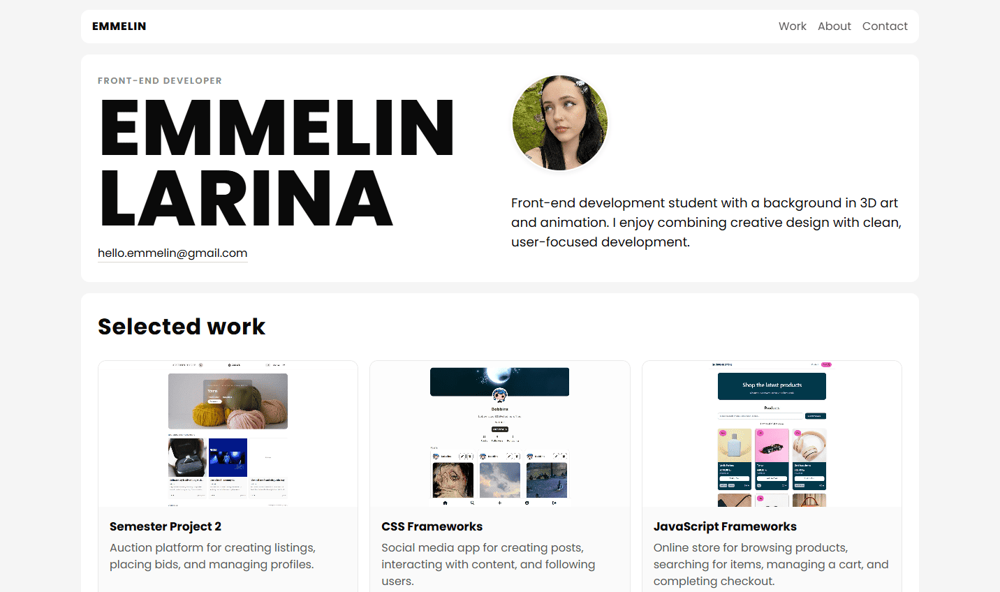

# Portfolio 2



A multipage front-end development portfolio showcasing selected projects, project improvements, and my development skills.

[Live Site](link)
[GitHub Repo](https://github.com/emmelinlarina/Portfolio-2)

## About the Project

Portfolio 2 was developed as part of the Front-End Development programme at Noroff.

The portfolio expands on my previous Portfolio 1 project and presents three selected projects through individual project pages:

- CSS Frameworks
- JavaScript Frameworks
- Semester Project 2

Each project page provides information about the project, links to the live site and GitHub repository, and details about the work completed.

## Tech Used

- **HTML5**
- **CSS3**
- **Vanilla JavaScript**

## Getting started

### Installing

1. Clone the repository:

```bash
git clone https://github.com/emmelinlarina/Portfolio-2
```

2. Navigate to the project directory

```bash
cd Portfolio-2
```

No additional dependencies are required.

### Running

Open `index.html` in your browser or use a local development server such as Live Server in VS Code.

## Contact

[GitHub](https://github.com/emmelinlarina)

[LinkedIn](YOUR-LINKEDIN-URL)
